# PainelGRID — mapa do projeto

O PainelGRID é uma plataforma multicliente para captar leads, operar eventos automotivos, automatizar credenciamento pelo Rubinho, coordenar recepção e vendedores e medir agendamentos, comparecimentos e vendas.

## Navegação principal

| Área | Notas |
|---|---|
| Produto | [[Visao do Produto]], [[Perfis e Permissoes]], [[Glossario]] |
| Arquitetura | [[Arquitetura Geral]], [[Backend API]], [[Frontend e Mobile]], [[Banco de Dados]], [[Realtime e Filas]], [[Monorepo e Pacotes]] |
| Domínios | [[Leads e CRM]], [[Eventos e Agendamentos]], [[Rubinho e Conversas]], [[Campanhas e Meta]], [[WhatsApp e Templates]], [[Vendedores e Atendimento]], [[Vendas Scores e Relatorios]], [[Veiculos e FIPE]], [[Autenticacao Usuarios e Clientes]], [[Conteudo Notificacoes e Avaliacoes]] |
| Jornadas | [[Lead Meta ate CRM]], [[Credenciamento Rubinho e QR Code]], [[Check-in e Fila de Atendimento]], [[Atendimento ate Venda]], [[Exclusao de Lead]], [[Disparos e Recuperacao]] |
| Integrações | [[Meta]], [[WhatsApp]], [[n8n]], [[Supabase e PostgreSQL]], [[Redis e Filas]], [[Email Storage e Provedores]] |
| Operação | [[Ambientes e Deploy]], [[Configuracao e Variaveis]], [[Observabilidade]], [[Testes e CI]], [[Runbook Operacional]] |
| Referência | [[Mapa de API]], [[Mapa de Telas]], [[Mapa de Dados]], [[Scripts e Migracoes]], [[Riscos e Divida Tecnica]] |

## Visão de ponta a ponta

```mermaid
flowchart LR
  Meta[Meta Lead Ads] --> Ingestao[Webhook ou polling]
  Ingestao --> Lead[Lead no cliente e evento]
  Lead --> Template[Template WhatsApp]
  Template --> Rubinho[Rubinho no n8n]
  Rubinho --> Agenda[Agendamento]
  Agenda --> QR[Credencial e QR Code]
  QR --> Checkin[Check-in no evento]
  Checkin --> Fila[Fila de atendimento]
  Fila --> Vendedor[Vendedor disponível]
  Vendedor --> Venda[Venda ou encerramento]
  Venda --> Relatorios[Relatórios e atribuição]
```

## Fontes da verdade

- Modelo de dados: `apps/api/prisma/schema.prisma`.
- API: `apps/api/src`.
- Aplicações web e mobile: `apps/desktop/src` e configurações Capacitor.
- Workflows versionados: `docs/n8n/workflows`.
- Migrações: `apps/api/prisma/migrations`.
- Contratos compartilhados: `packages/types`.

## Estado da documentação

Este mapa cobre o monorepo, os papéis, as telas, os módulos da API, o banco, as integrações e os principais fluxos operacionais. Mudanças relevantes devem atualizar a nota do domínio e, quando alterarem uma decisão arquitetural, criar um registro em [[Decisoes Arquiteturais]].

