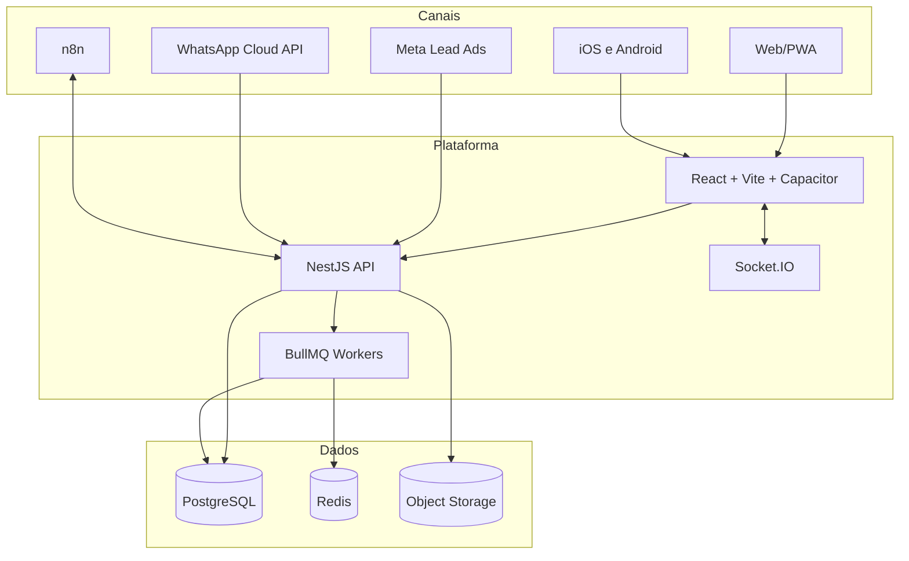

# Arquitetura Geral

## Camadas

- **Experiência:** React/Vite, rotas por perfil, PWA e Capacitor.
- **Aplicação:** módulos NestJS, DTOs validados e regras transacionais.
- **Automação:** n8n para orquestração conversacional e rotinas externas.
- **Assíncrono:** BullMQ e Redis para tarefas que não devem bloquear requisições.
- **Persistência:** Prisma/PostgreSQL com histórico, auditoria e idempotência.
- **Integração:** Meta, WhatsApp, e-mail, consulta veicular e storage.

## Fronteiras importantes

O n8n não deve ser a fonte exclusiva de estado de negócio. Leads, conversas, etapa, agendamento, dispatch e ações do agente são persistidos na API. As automações chamam contratos autenticados e idempotentes. Veja [[Rubinho e Conversas]] e [[n8n]].

