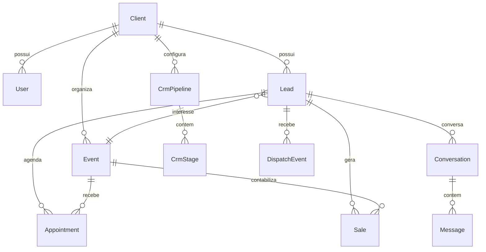

# Banco de Dados

PostgreSQL é a fonte central de estado. O schema Prisma está em `apps/api/prisma/schema.prisma` e as mudanças versionadas em `apps/api/prisma/migrations`.

## Núcleos do modelo

## Famílias de dados

- Identidade e tenancy: `User`, `Client`, `IntegrationCredential`.
- Funil: `Lead`, `CrmPipeline`, `CrmStage`, `CrmHistory`, `LeadTimeline`.
- Evento: `Event`, `EventParticipant`, `Appointment`, `Sale`, `ServiceRating`.
- Comunicação: `Conversation`, `Message`, `DispatchEvent`, `WhatsAppAttributionEvent`.
- Agente: `ConversationState`, `AgentActionLog`, `RubinhoAgent*`.
- Meta: conexões, ativos, formulários, campanhas, anúncios, importações e insights.
- Operação: `OperationalIssue`, `OperationalHeartbeat`, `ApiIdempotencyRequest`.

Veja [[Mapa de Dados]] para o catálogo completo.

O catálogo modelo a modelo, incluindo enums, permissões recentes e invariantes, está em [[Catalogo do Banco]].
