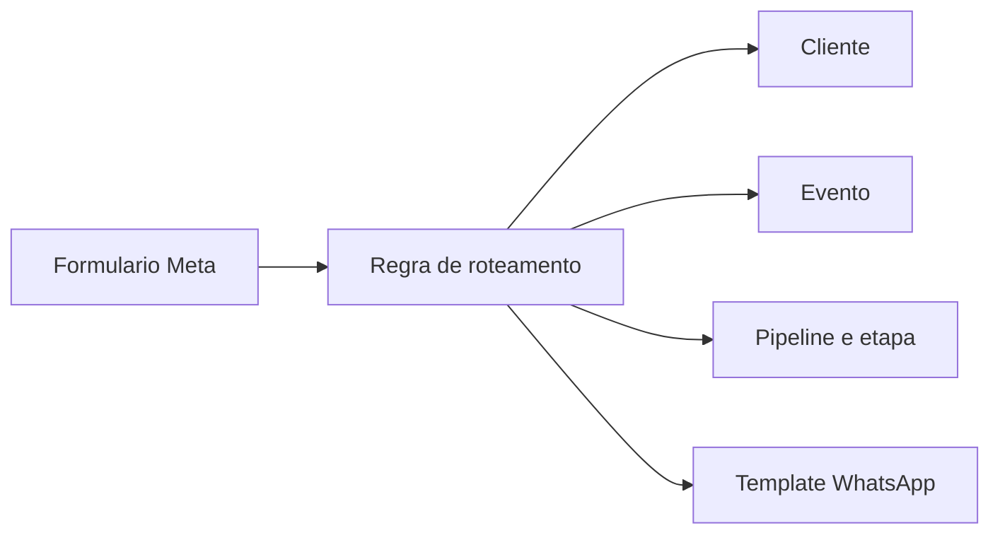

# Campanhas e Meta

## Responsabilidade

Conecta Business Manager, página, conta de anúncios, formulário, campanha, conjunto e anúncio ao cliente e ao evento correto.

## Componentes

- API: `apps/api/src/modules/meta` e `apps/api/src/modules/campaigns`.
- Persistência: `MetaConnection`, seleções de ativos, formulários, regras de roteamento, campanhas, conjuntos, anúncios, criativos, imports e insights diários.
- Interface: aba Ads do cliente, campanhas e relatórios.

## Identificação do lead

O `form_id` é a chave mais segura para direcionar o lead ao cliente, evento, pipeline, etapa e template configurados. Página e campanha complementam a atribuição.

## Métricas

Investimento, leads, CPL, impressões, alcance e conversas vêm da Meta; agendamentos, presença, vendas e receita vêm da jornada interna. A união deve usar IDs, janela do evento e atribuição documentada.

## Riscos

- Campanhas sem nome quando apenas o ID foi importado.
- Formulário ativo, mas página/app sem assinatura `leadgen`.
- Token que lê leads, mas não pertence ao app que está inscrito na página.
- Campanhas fora da janela do evento contaminando o relatório.

## Relacionamentos

- [[Meta]]
- [[Lead Meta ate CRM]]
- [[Vendas Scores e Relatorios]]

