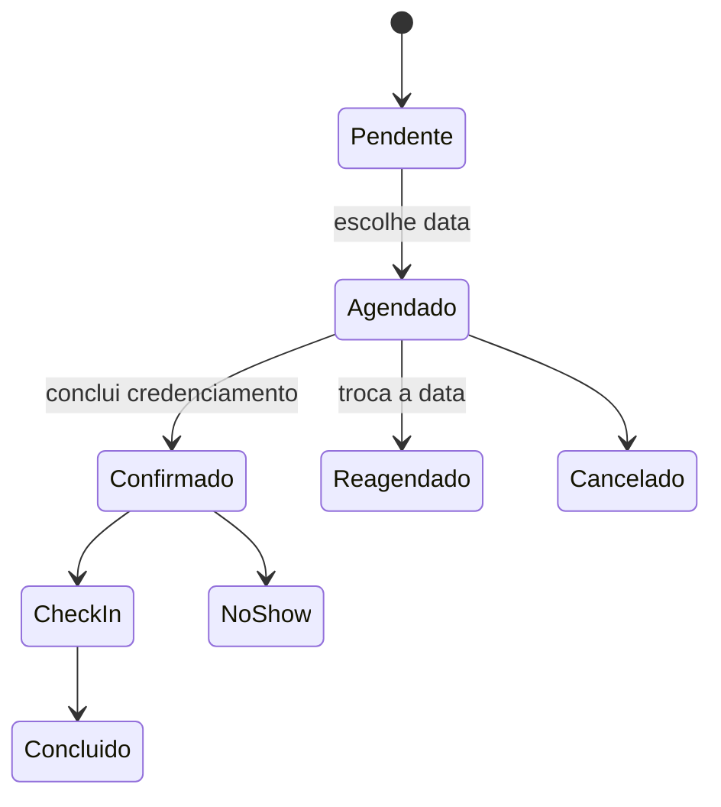

# Eventos e Agendamentos

## Responsabilidade

Modela o evento comercial, datas, endereço, participantes, credenciamento, agendamento, confirmação, check-in e presença.

## Componentes

- API: `apps/api/src/modules/events` e `apps/api/src/modules/appointments`.
- Persistência: `Event`, `EventParticipant` e `Appointment`.
- Interfaces: gestão do evento, operação, recepção, painel TV e relatórios.

## Regras centrais

- A data escolhida deve ser uma opção publicada pelo evento.
- Um agendamento ativo deve ser reutilizado ou reconciliado de forma idempotente.
- `scheduled`, confirmação final, check-in, conclusão e no-show são estados diferentes.
- Ao escolher a data, o fluxo pode mover silenciosamente o card para presença agendada sem considerar o credenciamento concluído.
- A credencial depende de um agendamento ativo coerente com lead e evento.

## Linha de estado

## Relacionamentos

- [[Credenciamento Rubinho e QR Code]]
- [[Check-in e Fila de Atendimento]]
- [[Vendas Scores e Relatorios]]

