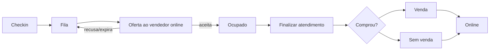

# Vendedores e Atendimento

## Responsabilidade

Organiza equipes, disponibilidade, fila, oferta de atendimento, aceite/recusa, atendimento ativo, encerramento e resultado comercial.

## Componentes

- API: `vendor-queue`, `sales-teams`, `sales`, `vendor-score` e notificações.
- Persistência: `VendorAvailability`, `VendorAttendance`, `SalesTeam`, `SalesTeamMember`, `Sale` e `ScoreEvent`.
- Interfaces: painel do vendedor, recepção, fila e ranking.

## Estados do vendedor

- Online: pode receber atendimento.
- Ocupado: está atendendo e não recebe novo lead.
- Ausente: não participa da distribuição.

## Jornada

## Regras

- A oferta aparece em modal de alta prioridade.
- O modal de atendimento só encerra com finalização explícita.
- O resultado “comprou?” encerra a sessão e devolve o vendedor à fila.
- Distribuição e recusa precisam ser auditáveis.

## Relacionamentos

- [[Check-in e Fila de Atendimento]]
- [[Atendimento ate Venda]]
- [[Vendas Scores e Relatorios]]

