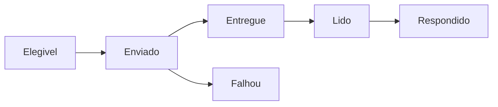

# WhatsApp e Templates

## Responsabilidade

Gerencia número/WABA, templates, webhooks de mensagens e status, conversas, mídia, disparos e entrega de credenciais.

## Componentes

- API: módulos `meta`, `conversations`, `dispatches` e `automations`.
- Persistência: `Message`, `Conversation`, `DispatchEvent`, `WhatsAppAttributionEvent`.
- Provedor principal: WhatsApp Cloud API da Meta.

## Ciclo de um disparo

O sistema deve diferenciar `aceito pela API`, `enviado`, `entregue`, `lido`, `respondido` e `falhou`. Somente o webhook de status confirma entrega.

## Regras

- Um mesmo número do Rubinho pode atender vários clientes apenas com contexto inequívoco por disparo/formulário/evento.
- O CTA oficial do fluxo é “Garantir minha vaga”; gatilhos antigos podem ser aceitos por compatibilidade.
- Cadência deve respeitar limites, qualidade do número e idempotência.
- Falhas de pagamento, template rejeitado e número desconectado devem gerar issue operacional.

## Relacionamentos

- [[WhatsApp]]
- [[Disparos e Recuperacao]]
- [[Observabilidade]]
