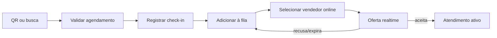

# Check-in e Fila de Atendimento

## Entrada

O check-in pode ser feito por QR Code ou busca manual na recepção. Deve localizar o agendamento do mesmo cliente/evento e registrar horário real.

## Fluxo

## Regras

- Vendedores ausentes ou ocupados não recebem oferta.
- Uma pessoa não deve ter duas posições ativas na fila.
- Oferta tem expiração e idempotência.
- Aceite muda disponibilidade para ocupado.
- Recepção visualiza estado e exceções em tempo real.

## Métricas

- Espera média e percentis.
- Taxa de aceite/recusa.
- Atendimentos por vendedor/equipe.
- Check-ins por hora.
- No-show e capacidade do evento.

## Relacionamentos

- [[Vendedores e Atendimento]]
- [[Realtime e Filas]]
- [[Atendimento ate Venda]]

