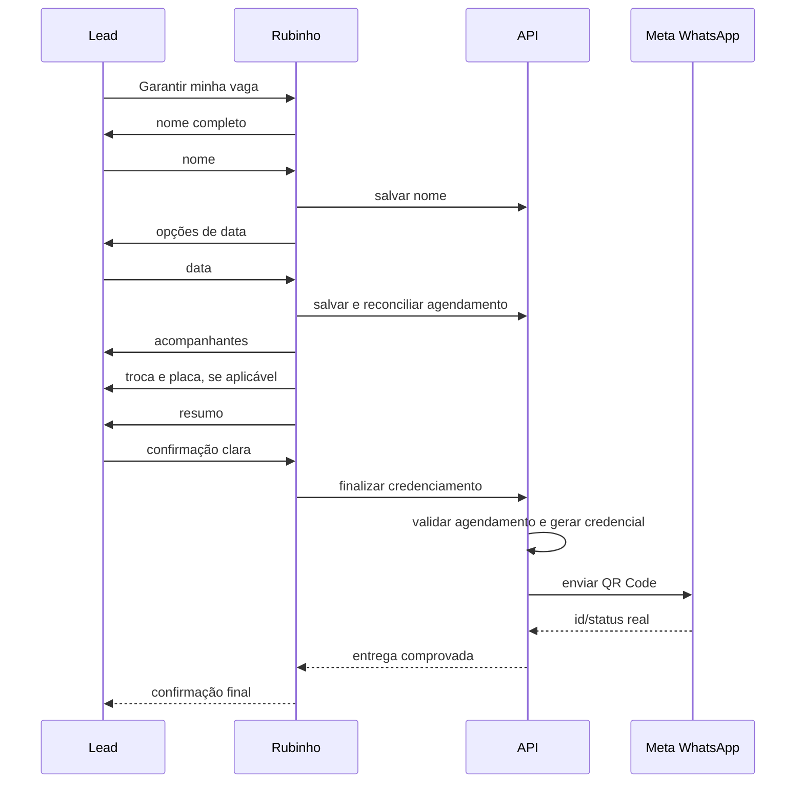

# Credenciamento Rubinho e QR Code

## Sequência

## Contrato de finalização

- `lead_id`, `event_id` e `scheduled_at` precisam ser coerentes.
- `scheduled_at` deve ser ISO 8601 válido.
- A finalização é idempotente.
- Entrega da credencial exige agendamento ativo.
- O agente só afirma envio do QR após retorno real.
- E-mail pode ser enviado pela aplicação, mas ausência de e-mail não deve impedir o QR no WhatsApp.

## Falhas conhecidas a prevenir

- Chave de automação inválida.
- Data `undefined` ou fora do evento.
- Agendamento inexistente.
- ToolMessage órfã na memória do agente.
- QR enviado duas vezes por fluxos concorrentes.

## Relacionamentos

- [[Rubinho e Conversas]]
- [[Eventos e Agendamentos]]
- [[WhatsApp e Templates]]

