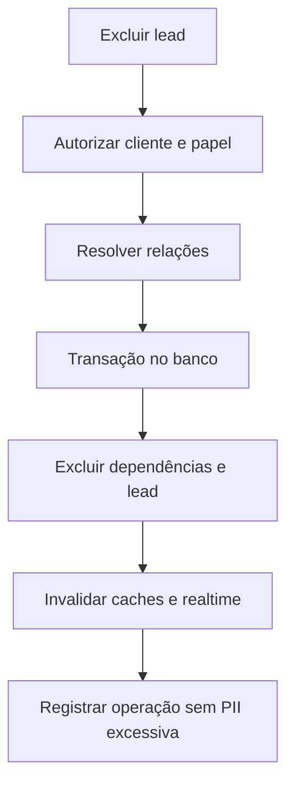

# Exclusao de Lead

## Objetivo

Ao excluir um lead, remover também todo dado operacional referente a ele para impedir reaproveitamento indevido de histórico e contexto entre eventos/clientes.

## Escopo

- Conversas e mensagens.
- Estado persistente e memória do agente.
- Ações/auditoria do Rubinho.
- Timeline e histórico de CRM.
- Agendamentos, fila e atendimentos compatíveis com a regra de negócio.
- Disparos e atribuições.
- Veículo e demais relações exclusivas.

## Processo

## Regras

- A operação deve ser transacional.
- Dados compartilhados, como evento e campanha, não são excluídos.
- Falha parcial provoca rollback.
- Após exclusão, uma nova mensagem deve criar contexto novo e não recuperar memória antiga.

## Relacionamentos

- [[Leads e CRM]]
- [[Banco de Dados]]
- [[Riscos e Divida Tecnica]]

