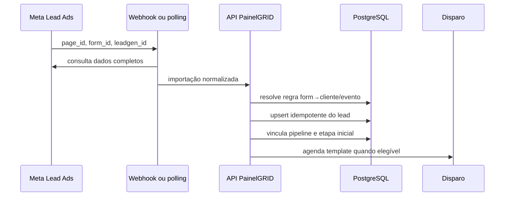

# Lead Meta ate CRM

## Fluxo principal

## Validações

1. App inscrito na página no campo `leadgen`.
2. Token com `leads_retrieval`, acesso à página e pertencente ao app correto.
3. Formulário ativo e mapeado uma única vez.
4. Cliente, evento, pipeline e etapa ativos.
5. Nome, telefone, e-mail e preferência de contato normalizados.
6. `meta_lead_id` tratado como idempotency key.
7. Falhas enviadas ao painel de exceções.

## Contingência

O polling recupera perdas do webhook. Ele não deve duplicar leads nem reenviar templates já confirmados como enviados.

## Evidências

- Importação registrada em `MetaLeadImport`.
- Timeline do lead com origem e formulário.
- `DispatchEvent` para o template.
- Métricas de atraso entre `created_time` e importação.

## Relacionamentos

- [[Campanhas e Meta]]
- [[Meta]]
- [[Disparos e Recuperacao]]

