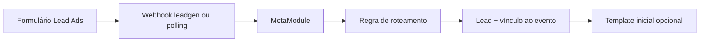

# Meta

## Responsabilidades

- Conectar Business Manager, páginas, contas de anúncio e formulários.
- Sincronizar campanhas, conjuntos, anúncios, criativos e métricas.
- Receber ou consultar leads de formulários.
- Resolver o destino do lead por formulário, cliente, evento, pipeline e etapa.

## Fluxo principal

## Persistência

- `MetaConnection`: conexão e escopo do cliente.
- `MetaAssetSelection`: ativos escolhidos.
- `MetaLeadRoutingRule`: formulário → cliente/evento/pipeline/etapa/template.
- `MetaCampaign`, `MetaAdSet`, `MetaAd`, `MetaCreative`, `MetaLeadForm`.
- `MetaLeadImport`, `MetaDailyInsight`, `MetaSyncJob`.

## Pontos críticos

- A assinatura `leadgen` ocorre na página, não no formulário.
- Consultar um lead exige token com `leads_retrieval` e acesso à página.
- O `form_id` é a chave mais segura para separar clientes que usam o mesmo número de WhatsApp.
- Webhook e polling devem ser idempotentes pelo ID do lead da Meta.
- Não armazenar tokens em notas, logs ou workflows exportados.

## Diagnóstico

1. Confirmar que formulário e página são os esperados.
2. Verificar `/{page_id}/subscribed_apps` e o campo `leadgen`.
3. Testar `/{form_id}/leads?limit=1` com a mesma credencial do runtime.
4. Conferir a regra ativa de roteamento.
5. Procurar o ID da Meta em `MetaLeadImport`, `Lead` e issues operacionais.
6. Validar se a importação foi deduplicada ou rejeitada.

Relacionados: [[Campanhas e Meta]], [[Lead Meta ate CRM]], [[Mapa de API]], [[Observabilidade]].

