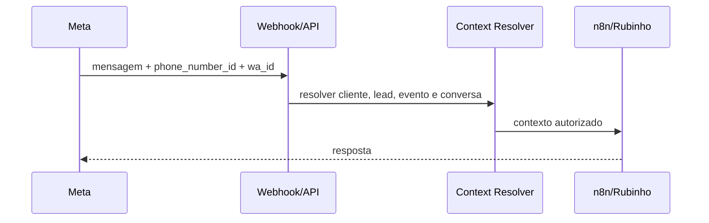

# WhatsApp

## Papel na plataforma

O WhatsApp é o canal de entrada e saída do Rubinho, dos templates e da credencial. A identidade técnica do canal usa principalmente `phone_number_id`, WABA e número normalizado.

## Entrada

## Saída

- Template inicial fora da janela de 24 horas.
- Mensagem livre dentro da janela permitida.
- QR Code como mídia/documento acompanhado de mensagem controlada.
- Status de envio, entrega, leitura e falha persistidos em `DispatchEvent` e mensagens.

## Regras de roteamento

- O mesmo `phone_number_id` pode atender vários clientes.
- O contexto não pode ser decidido somente pelo número do Rubinho.
- Prioridade: resposta a um disparo conhecido → último disparo válido → vínculo inequívoco do lead ao evento.
- Ambiguidade deve gerar issue/handoff, nunca escolha arbitrária de cliente.

## Falhas comuns

- Restrição de pagamento da WABA.
- Template rejeitado, inexistente ou parâmetros incompatíveis.
- Janela de conversa fechada.
- Lead sem contexto ou com duplicidade entre eventos.
- QR Code sem agendamento ativo.

Relacionados: [[WhatsApp e Templates]], [[Rubinho e Conversas]], [[Disparos e Recuperacao]], [[Runbook Operacional]].

