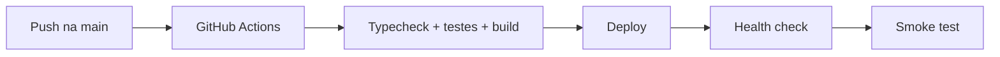

# Ambientes e Deploy

## Componentes implantáveis

- `apps/api`: serviço NestJS.
- `apps/desktop`: aplicação React/Vite servida na web e empacotável por Capacitor.
- PostgreSQL e Redis.
- n8n como orquestrador externo.

## Pipeline esperado

## Railway

Os serviços de produção podem ser operados no Railway. Antes de publicar:

1. Validar variáveis do ambiente.
2. Aplicar migrações com conexão direta.
3. Confirmar build e comando de start.
4. Verificar `/health` e logs.
5. Fazer smoke test de login, leads, evento e integrações críticas.

## Mobile

O frontend possui configuração Capacitor para iOS/Android. Builds mobile devem manter a mesma URL/API de ambiente e testar autenticação, câmera/QR e notificações.

## Regra de produção

Workflows ativos e Rubinho em produção são componentes externos sensíveis: mudanças devem ser homologadas e ativadas de forma explícita.

Relacionados: [[Testes e CI]], [[Configuracao e Variaveis]], [[Runbook Operacional]].

