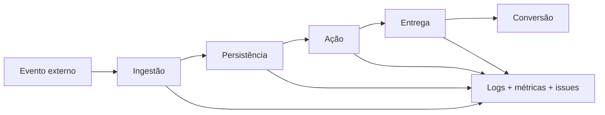

# Observabilidade

## Fontes

- Logs estruturados da API e do n8n.
- Sentry no backend e frontend.
- `ApiRequestMetric` e `WebVitalMetric`.
- `OperationalIssue` e `OperationalHeartbeat`.
- `AgentActionLog`, timeline do lead e eventos de disparo.
- Métricas do Railway, Redis, PostgreSQL e Meta.

## Alertas essenciais

- Workflow parado ou sem heartbeat.
- Token Meta próximo de expirar ou inválido.
- Número WhatsApp desconectado ou conta com restrição de pagamento.
- Aumento da taxa de erro.
- Leads Meta disponíveis, mas não importados.
- Fila acumulada ou job antigo.
- Template rejeitado/falhando.
- API de veículo/FIPE indisponível.
- QR Code não entregue.
- Conversa aguardando intervenção humana.

## Painel de exceções

Deve consolidar formulário desconhecido, cliente não identificado, evento ausente, lead sem etapa, falha de template/FIPE/agendamento/QR e handoff humano.

## Auditoria do Rubinho

Cada decisão deve registrar estado anterior, mensagem, próxima etapa, ferramenta, dados enviados, resposta, estado resultante e motivo de bloqueio/handoff.

## Sinais de saúde

Relacionados: [[Auditoria e Estado]], [[Runbook Operacional]], [[Mapa de Dados]].

