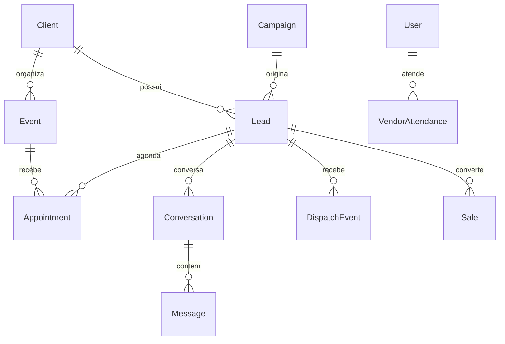

# Mapa de Dados

## Identidade e tenancy

- `User`: identidade, papel e acesso.
- `Client`: locatário principal do sistema.
- `IntegrationCredential`: segredo externo protegido.
- `Store`: loja associada ao cliente.

## Comercial

- `Lead`: centro da jornada comercial.
- `CrmPipeline`, `CrmStage`, `CrmHistory`: posição e movimentação no funil.
- `LeadTimeline`: trilha consolidada do lead.
- `Event`, `EventParticipant`: evento e participantes.
- `Appointment`: visita agendada, check-in, cancelamento e no-show.
- `Sale`: venda, valor, vendedor e equipe.
- `Vehicle`: dados consultados por placa e FIPE.

## Conversa e automação

- `Conversation`, `Message`: conversa e mensagens.
- `ConversationState`: estado persistente do atendimento.
- `AgentActionLog`: decisão e ação do agente.
- `DispatchEvent`: envio, entrega, leitura, resposta, falha e conversão.
- `WebhookEvent`: recepção idempotente de webhooks.
- `OperationalIssue`, `OperationalHeartbeat`: exceções e saúde.
- `ApiIdempotencyRequest`: proteção de operações repetidas.

## Meta

- `MetaConnection` e `FacebookAdAccount`.
- `MetaAssetSelection` e `MetaLeadRoutingRule`.
- `MetaCampaign`, `MetaCampaignAssignment`, `MetaAdSet`, `MetaAd`, `MetaCreative`.
- `MetaLeadForm`, `MetaLeadImport`, `MetaDailyInsight`.
- `WhatsAppAttributionEvent` e `MetaSyncJob`.

## Pessoas e atendimento presencial

- `SalesTeam`, `SalesTeamMember`.
- `VendorAvailability`, `VendorAttendance`.
- `ServiceRating`, `ScoreEvent`.

## Conhecimento e capacitação

- `RubinhoAgent`, `RubinhoAgentEvent`, `RubinhoAgentFaq`, `RubinhoAgentDocument`.
- `Course`, `Lesson`, `CourseProgress`.

## Relações que exigem cuidado

## Invariantes

- O mesmo telefone pode existir em contextos distintos; cliente e evento fazem parte da identidade operacional.
- Um agendamento ativo é necessário para entrega de credencial.
- Exclusão de lead deve remover conversa, memória, disparos, agendamentos, auditoria e rastros relacionados.
- Números de campanha sem nome devem ser enriquecidos pela Meta, nunca apresentados como se fossem campanhas distintas conhecidas.
- Métricas executivas devem preferir eventos reais a estimativas.

## Relacionamentos

- [[Banco de Dados]]
- [[Exclusao de Lead]]
- [[Credenciamento Rubinho e QR Code]]
- [[Campanhas e Meta]]
- [[Scripts e Migracoes]]

