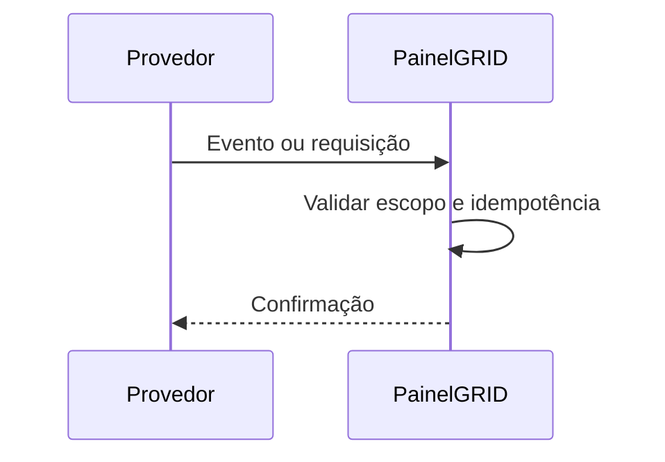

# Integração — {{title}}

## Objetivo e proprietário

- Provedor:
- Responsável interno:
- Ambiente:

## Contrato

- Autenticação:
- Base URL:
- Endpoints/webhooks:
- Limites e timeouts:
- Campos de correlação:

> [!warning] Segredos
> Registre apenas nomes de variáveis ou referências ao cofre. Nunca inclua tokens e chaves.

## Fluxo e idempotência

## Falhas, retry e reconciliação

- Timeout:
- Backoff:
- Chave idempotente:
- Reconciliação:
- Dead-letter/intervenção:

## Observabilidade

- Logs:
- Métricas:
- Alertas:
- Runbook:

## Relacionamentos

- [[Arquitetura Geral]]
- [[Runbook Operacional]]
